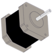

---
# **官网+论坛**

- [**进入官网**](https://www.weeemake.com.cn)
- [**进入论坛**](https://www.weeemake.com.cn/bbs/)

---
# **编程软件**

<!-- tabs:start -->

## **WeeeCode**

</img>

> [!NOTE]
> - 支持的主控板：全平台
>
> - 详情链接 **→** [WeeeCode详细介绍](docs\software_usage\weeecode\weeecode.md)

## **Arduino IDE**

</img>

> [!NOTE]
> - 支持的主控板：ELF 328P、ELF 2560、ELF MINI、ELF PI、ELF UNO、ELF UNO Shield
> 
> - 详情链接 **→** [Arduino IDE介绍](https://mp.weixin.qq.com/s/_8lvpPDArM_Z-MI9iul1AA)

## **Mixly(米思齐)**

> [!NOTE]
> - 支持的主控板：全平台
>
> - 详情链接 **→** [Mixly介绍](https://mp.weixin.qq.com/s/dm2Qm4zZhHxEvcFgNS_mrA)

## **编程猫——源码编辑器**

> [!NOTE]
> - 支持的主控板：ELF MINI
>
> - 详情链接 **→** [编程猫——源码编辑器介绍](https://mp.weixin.qq.com/s/rAoamIey7cARMES7kfIaLw)

## **编程猫——海归编辑器**

> [!NOTE]
> - 支持的主控板：micro:bit V1、micro:bit V2
>
> - 详情链接 **→** [编程猫——海归编辑器介绍](https://mp.weixin.qq.com/s/rAoamIey7cARMES7kfIaLw)

## **MakeCode**

> [!NOTE]
> - 支持的主控板：micro:bit V1、micro:bit V2
>
> - 详情链接 **→** [MakeCode介绍](https://mp.weixin.qq.com/s/rAoamIey7cARMES7kfIaLw)

## **Mu Editor**

> [!NOTE]
> - 支持的主控板：micro:bit V1、micro:bit V2、ELF ESP32
>
> - 详情链接 **→** [Mu Editor介绍](https://mp.weixin.qq.com/s/rAoamIey7cARMES7kfIaLw)

## **Thonny IDE**

> [!NOTE]
> - 支持的主控板：micro:bit V1、micro:bit V2、ELF ESP32、K210
>
> - 详情链接 **→** [Thonny IDE介绍](https://mp.weixin.qq.com/s/rAoamIey7cARMES7kfIaLw)

<!-- tabs:end -->

---
# **主控板**

## **Arduino系列**

<!-- tabs:start -->

### **ELF 328P**

### **ELF 2560**

### **ELF MINI**

### **ELF UNO**

### **ELF UNO Shield**

<!-- tabs:end -->

## **K210系列**

<!-- tabs:start -->

### **ELF K210**

<!-- tabs:end -->

## **micro:bit系列**

<!-- tabs:start -->

### **micro:bit v1**

### **micro:bit v2**

### **micro:bit Shield v1**

### **micro:bit Shield v2**

<!-- tabs:end -->

## **ESP32系列**

<!-- tabs:start -->

### **ELF ESP32**

<!-- tabs:end -->

---

# **电子模块**
## **RJ11系列**
### **传感类**
<!-- panels:start -->
<!-- div:left-panel -->

- [RGB超声波传感器](docs/electronic_modules/rj11/rgb_ultrasonic_sensor/rgb_ultrasonic_sensor.md)
- [温湿度传感器](https://mp.weixin.qq.com/s/NqG7GzsPhwI76h3nujTCgQ)
- [火焰传感器](https://mp.weixin.qq.com/s/NqG7GzsPhwI76h3nujTCgQ)
- [人体红外传感器](https://mp.weixin.qq.com/s/-MYQ-meSUcr-wZhfUbGq3Q)
- [单路触摸传感器](https://mp.weixin.qq.com/s/NqG7GzsPhwI76h3nujTCgQ)
- [陀螺仪传感器](https://mp.weixin.qq.com/s/NqG7GzsPhwI76h3nujTCgQ)
- [雨滴传感器](https://mp.weixin.qq.com/s/-MYQ-meSUcr-wZhfUbGq3Q)
- [气压传感器](https://mp.weixin.qq.com/s/NqG7GzsPhwI76h3nujTCgQ)
- [语音识别传感器](https://mp.weixin.qq.com/s/NqG7GzsPhwI76h3nujTCgQ)
- [紫外线传感器](https://mp.weixin.qq.com/s/-MYQ-meSUcr-wZhfUbGq3Q)

<!-- div:right-panel -->
- [巡线传感器](https://mp.weixin.qq.com/s/NqG7GzsPhwI76h3nujTCgQ)
- [倾斜开关传感器](https://mp.weixin.qq.com/s/-MYQ-meSUcr-wZhfUbGq3Q)
- [可燃气体传感器](https://mp.weixin.qq.com/s/NqG7GzsPhwI76h3nujTCgQ)
- [颜色识别传感器](https://mp.weixin.qq.com/s/NqG7GzsPhwI76h3nujTCgQ)
- [多路触摸传感器](https://mp.weixin.qq.com/s/-MYQ-meSUcr-wZhfUbGq3Q)
- [电子指南针传感器](https://mp.weixin.qq.com/s/NqG7GzsPhwI76h3nujTCgQ)
- [PM2.5传感器](https://mp.weixin.qq.com/s/-MYQ-meSUcr-wZhfUbGq3Q)
- [手势识别传感器](https://mp.weixin.qq.com/s/NqG7GzsPhwI76h3nujTCgQ)
- [图像识别传感器](https://mp.weixin.qq.com/s/NqG7GzsPhwI76h3nujTCgQ)

<!-- panels:end -->

### **操控类**
<!-- panels:start -->
<!-- div:left-panel -->
- [4位背光按键模块](https://mp.weixin.qq.com/s/-MYQ-meSUcr-wZhfUbGq3Q)
- [旋转电位器模块](https://mp.weixin.qq.com/s/NqG7GzsPhwI76h3nujTCgQ)
- [限位开关模块](https://mp.weixin.qq.com/s/NqG7GzsPhwI76h3nujTCgQ)

<!-- div:right-panel -->
- [全向摇杆模块](https://mp.weixin.qq.com/s/NqG7GzsPhwI76h3nujTCgQ)
- [滑动电位器模块](https://mp.weixin.qq.com/s/-MYQ-meSUcr-wZhfUbGq3Q)

<!-- panels:end -->

### **执行类**
<!-- panels:start -->
<!-- div:left-panel -->
- [MP3模块](https://mp.weixin.qq.com/s/-MYQ-meSUcr-wZhfUbGq3Q)
- [继电器模块](https://mp.weixin.qq.com/s/NqG7GzsPhwI76h3nujTCgQ)
- [语音合成模块](https://mp.weixin.qq.com/s/NqG7GzsPhwI76h3nujTCgQ)

<!-- div:right-panel -->
- [130直流电机模块](https://mp.weixin.qq.com/s/NqG7GzsPhwI76h3nujTCgQ)
- [雾化器模块](https://mp.weixin.qq.com/s/-MYQ-meSUcr-wZhfUbGq3Q)

<!-- panels:end -->

### **显示类**
<!-- panels:start -->
<!-- div:left-panel -->
- [LED面板矩阵屏](https://mp.weixin.qq.com/s/-MYQ-meSUcr-wZhfUbGq3Q)
- [0.96寸OLED显示屏](https://mp.weixin.qq.com/s/NqG7GzsPhwI76h3nujTCgQ)
- [单色LED灯模块](https://mp.weixin.qq.com/s/NqG7GzsPhwI76h3nujTCgQ)

<!-- div:right-panel -->
- [数码管模块](https://mp.weixin.qq.com/s/NqG7GzsPhwI76h3nujTCgQ)
- [RGB-5模块](https://mp.weixin.qq.com/s/-MYQ-meSUcr-wZhfUbGq3Q)

<!-- panels:end -->

### **通信类**
<!-- panels:start -->
<!-- div:left-panel -->
- [WiFi模块](https://mp.weixin.qq.com/s/-MYQ-meSUcr-wZhfUbGq3Q)

<!-- div:right-panel -->
- [智能红外模块](https://mp.weixin.qq.com/s/NqG7GzsPhwI76h3nujTCgQ)

<!-- panels:end -->

### **转接类**
<!-- panels:start -->
<!-- div:left-panel -->
- [RJ11转插针模块](https://mp.weixin.qq.com/s/-MYQ-meSUcr-wZhfUbGq3Q)

<!-- div:right-panel -->

<!-- panels:end -->

## **ELF插针类**
<!-- panels:start -->
<!-- div:left-panel -->
- [声音传感器](https://mp.weixin.qq.com/s/-MYQ-meSUcr-wZhfUbGq3Q)
- [红外接收传感器](https://mp.weixin.qq.com/s/NqG7GzsPhwI76h3nujTCgQ)
- [编码电机驱动模块](https://mp.weixin.qq.com/s/NqG7GzsPhwI76h3nujTCgQ)
- [USB HOST模块](https://mp.weixin.qq.com/s/NqG7GzsPhwI76h3nujTCgQ)

<!-- div:right-panel -->
- [光线传感器](https://mp.weixin.qq.com/s/NqG7GzsPhwI76h3nujTCgQ)
- [RGB-8灯环模块](https://mp.weixin.qq.com/s/-MYQ-meSUcr-wZhfUbGq3Q)
- [步进电机驱动模块](https://mp.weixin.qq.com/s/NqG7GzsPhwI76h3nujTCgQ)
- [Adapter模块](https://mp.weixin.qq.com/s/-MYQ-meSUcr-wZhfUbGq3Q)

<!-- panels:end -->

## **电机/舵机**
<!-- panels:start -->
<!-- div:left-panel -->
- [TT直流电机](https://mp.weixin.qq.com/s/-MYQ-meSUcr-wZhfUbGq3Q)
- [25MM直流电机](https://mp.weixin.qq.com/s/NqG7GzsPhwI76h3nujTCgQ)
- [MG995舵机](https://mp.weixin.qq.com/s/NqG7GzsPhwI76h3nujTCgQ)

<!-- div:right-panel -->
- [42步进电机](https://mp.weixin.qq.com/s/NqG7GzsPhwI76h3nujTCgQ)
  - 
  - 42 BYG
  - DC 12V
- [25MM编码电机](https://mp.weixin.qq.com/s/-MYQ-meSUcr-wZhfUbGq3Q)
- [9克舵机](https://mp.weixin.qq.com/s/-MYQ-meSUcr-wZhfUbGq3Q)

<!-- panels:end -->

## **KF2510系列**

<!-- panels:start -->
<!-- div:left-panel -->
- [声音传感器](docs\electronic_modules\kf2510\sound_sensor\sound_sensor.md)
- [红外接收传感器](https://mp.weixin.qq.com/s/NqG7GzsPhwI76h3nujTCgQ)
- [LM35温度传感器](https://mp.weixin.qq.com/s/NqG7GzsPhwI76h3nujTCgQ)
- [单色LED灯模块](https://mp.weixin.qq.com/s/NqG7GzsPhwI76h3nujTCgQ)
- [限位开关模块](https://mp.weixin.qq.com/s/NqG7GzsPhwI76h3nujTCgQ)
- [旋转电位器模块](https://mp.weixin.qq.com/s/NqG7GzsPhwI76h3nujTCgQ)
- [无源蜂鸣器模块](https://mp.weixin.qq.com/s/NqG7GzsPhwI76h3nujTCgQ)
- [MP3模块](https://mp.weixin.qq.com/s/NqG7GzsPhwI76h3nujTCgQ)
- [数码管模块](https://mp.weixin.qq.com/s/NqG7GzsPhwI76h3nujTCgQ)

<!-- div:right-panel -->
- [光线传感器](https://mp.weixin.qq.com/s/NqG7GzsPhwI76h3nujTCgQ)
- [按键模块](https://mp.weixin.qq.com/s/-MYQ-meSUcr-wZhfUbGq3Q)
- [温湿度传感器](https://mp.weixin.qq.com/s/NqG7GzsPhwI76h3nujTCgQ)
- [RGB彩灯模块](https://mp.weixin.qq.com/s/-MYQ-meSUcr-wZhfUbGq3Q)
- [全向摇杆模块](https://mp.weixin.qq.com/s/NqG7GzsPhwI76h3nujTCgQ)
- [巡线传感器](https://mp.weixin.qq.com/s/NqG7GzsPhwI76h3nujTCgQ)
- [有源蜂鸣器模块](https://mp.weixin.qq.com/s/NqG7GzsPhwI76h3nujTCgQ)
- [130风扇模块](https://mp.weixin.qq.com/s/NqG7GzsPhwI76h3nujTCgQ)
- [无源蜂鸣器模块](https://mp.weixin.qq.com/s/NqG7GzsPhwI76h3nujTCgQ)

<!-- panels:end -->

## **其他模块**

