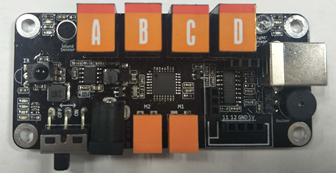
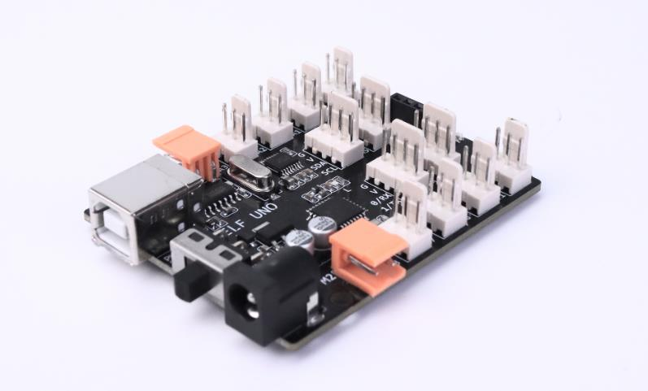

---

# **官网+论坛**

- [**进入官网**](https://www.weeemake.com.cn)
- [**进入论坛**](https://www.weeemake.com.cn/bbs/)
- [**进入旧wiki**](https://www.weeemake.com.cn/wiki/doku.php?id=wm_wiki:electronic_module_list)

---
# **编程软件**

<!-- tabs:start -->

## **WeeeCode**

</img>

> [!NOTE]
> - 支持的主控板：全平台
>
> - 详情链接 **→** [WeeeCode详细介绍](docs/software_usage/weeecode/weeecode.md)

## **Arduino IDE**

</img>

> [!NOTE]
> - 支持的主控板：ELF 328P、ELF 2560、ELF MINI、ELF PI、ELF UNO、ELF UNO Shield
> 
> - 详情链接 **→** [Arduino IDE介绍]()

## **Mixly(米思齐)**

> [!NOTE]
> - 支持的主控板：全平台
>
> - 详情链接 **→** [Mixly介绍])

## **编程猫——源码编辑器**

> [!NOTE]
> - 支持的主控板：ELF MINI
>
> - 详情链接 **→** [编程猫——源码编辑器介绍])

## **编程猫——海归编辑器**

> [!NOTE]
> - 支持的主控板：micro:bit V1、micro:bit V2
>
> - 详情链接 **→** [编程猫——海归编辑器介绍])

## **MakeCode**

> [!NOTE]
> - 支持的主控板：micro:bit V1、micro:bit V2
>
> - 详情链接 **→** [MakeCode介绍])

## **Mu Editor**

> [!NOTE]
> - 支持的主控板：micro:bit V1、micro:bit V2、ELF ESP32
>
> - 详情链接 **→** [Mu Editor介绍])

## **Thonny IDE**

> [!NOTE]
> - 支持的主控板：micro:bit V1、micro:bit V2、ELF ESP32、K210
>
> - 详情链接 **→** [Thonny IDE介绍])

<!-- tabs:end -->

---
# **主控板**

## **Arduino系列**

<!-- tabs:start -->

### **ELF 328P**

> [!NOTE]
>
> - 详情链接 **→** [ELF 328P详细介绍](docs/electronic_modules/main_control_board/elf_328p/elf_328p.md)

### **ELF 2560**

> [!NOTE]
> - 详情链接 **→** [ELF 2560详细介绍](docs/electronic_modules/main_control_board/elf_328p/elf_328p.md)

### **ELF MINI V1**

> [!NOTE]
> - 详情链接 **→** [ELF Mini V1详细介绍](docs/electronic_modules/main_control_board/elf_328p/elf_328p.md)

### **ELF MINI V2**

> [!NOTE]
> - 详情链接 **→** [ELF Mini V2详细介绍](docs/electronic_modules/main_control_board/elf_328p/elf_328p.md)

### **ELF MINI V3**

> [!NOTE]
> - 详情链接 **→** [ELF Mini V3详细介绍](docs/electronic_modules/main_control_board/elf_328p/elf_328p.md)

### **ELF UNO**

> [!NOTE]  
>
> - 详情链接 **→** [ELF UNO详细介绍](docs\electronic_modules\main_control_board\elf_uno\elf_uno.md)

### **ELF UNO Shield**

> [!NOTE]
>
> - 详情链接 **→** [ELF UNO Shield详细介绍](docs\electronic_modules\main_control_board\elf_uno_shield\elf_uno_shield.md)

<!-- tabs:end -->

## **K210系列**

<!-- tabs:start -->

### **ELF K210**

> [!NOTE]
> - 详情链接 **→** [ELF K210详细介绍](docs/electronic_modules/main_control_board/elf_k210/elf_k210.md)

<!-- tabs:end -->

## **micro:bit系列**

<!-- tabs:start -->

### **micro:bit v1**

### **micro:bit v2**

### **micro:bit Shield v1**

### **micro:bit Shield v2**

<!-- tabs:end -->

## **ESP32系列**

<!-- tabs:start -->
### **ELF ESP32 Pro**

> [!NOTE]
> - 详情链接 **→** [ELF ESP32 Pro详细介绍](docs/electronic_modules/main_control_board/elf_esp32_pro/elf_esp32_pro.md)

### **ELF ESP32**

> [!NOTE]
> - 详情链接 **→** [ELF ESP32详细介绍](docs/electronic_modules/main_control_board/elf_esp32/elf_esp32.md)

<!-- tabs:end -->

---

# **电子模块**

<!-- 用于在链接后显示图片 -->

## **RJ11系列**
### **传感类**
<!-- panels:start -->
<!-- div:left-panel -->
- [RGB超声波传感器](docs/electronic_modules/rj11/rgb_ultrasonic_sensor/rgb_ultrasonic_sensor.md)
- [温湿度传感器](docs/electronic_modules/rj11/temperature_and_humidity/temperature_and_humidity.md)
- [火焰传感器](docs/electronic_modules/rj11/flame_sensor/flame_sensor.md)
- [人体红外传感器](docs/electronic_modules/rj11/pir_sensor/pir_sensor.md)
- [单路触摸传感器](docs/electronic_modules/rj11/touch_sensor/touch_sensor.md)
- [陀螺仪传感器](docs/electronic_modules/rj11/gyro_sensor/gyro_sensor.md)
- [雨滴传感器](docs/electronic_modules/rj11/water_sensor/water_sensor.md)
- [气压传感器](docs/electronic_modules/rj11/barometer_sensor/barometer_sensor.md)
- [语音识别传感器V1](docs/electronic_modules/rj11/speech_recognition_v1/speech_recognition_v1.md)
- [语音识别传感器V2](docs/electronic_modules/rj11/speech_recognition_v2/speech_recognition_v2.md)
- [紫外线传感器](docs/electronic_modules/rj11/uv_sensor/uv_sensor.md)

<!-- div:right-panel -->

- [巡线传感器](docs/electronic_modules/rj11/linefollower_sensor/line_follower_sensor_v2.0.md)
- [多路巡线传感器](docs/electronic_modules/rj11/multiple_linefollower/multiple_linefollower.md)
- [倾斜开关传感器](docs/electronic_modules/rj11/tilt_switch_sensor/tilt_switch_sensor.md)
- [可燃气体传感器](docs/electronic_modules/rj11/Gas_Sensor/Gas_Sensor.md)
- [颜色识别传感器](docs/electronic_modules/rj11/color_sensor/color_sensor.md)
- [多路触摸传感器](docs/electronic_modules/rj11/funny_touch_sensor/funny_touch_sensor.md)
- [电子指南针传感器](docs/electronic_modules/rj11/compass_sensor/compass_sensor.md)
- [PM2.5传感器](docs/electronic_modules/rj11/pm25_sensor/pm25_sensor.md)
- [手势识别传感器](docs/electronic_modules/rj11/gesture_sensor/gesture_sensor.md)
- [图像识别传感器V1](docs/electronic_modules/rj11/imagerecognition_sensor/imagerecognition_sensor.md)
- [图像识别传感器V2]()

<!-- panels:end -->

### **操控类**
<!-- panels:start -->
<!-- div:left-panel -->

- [4位背光按键模块](docs/electronic_modules/rj11/four_led_button_module/four_led_button_module.md)
- [旋转电位器模块](docs/electronic_modules/rj11/potentiometer_module/potentiometer_module.md)
- [限位开关模块](docs/electronic_modules/rj11/switch_module/switch_module.md)

<!-- div:right-panel -->

- [全向摇杆模块](docs/electronic_modules/rj11/joystick_module/joystick_module.md)
- [滑动电位器模块](docs/electronic_modules/rj11/sliding_potentiometer_module/sliding_potentiometer_module.md)

<!-- panels:end -->

### **执行类**
<!-- panels:start -->
<!-- div:left-panel -->

- [MP3模块](docs/electronic_modules/rj11/mp3_module/mp3_module.md)
- [继电器模块](docs/electronic_modules/rj11/relay_module/relay_module.md)
- [语音合成模块]()

<!-- div:right-panel -->
- [130直流电机模块](docs/electronic_modules/rj11/130_dc_motor/130_dc_motor.md)
- [雾化器模块](docs/electronic_modules/rj11/atomizer_module/atomizer_module.md)

<!-- panels:end -->

### **显示类**
<!-- panels:start -->
<!-- div:left-panel -->
- [LED面板矩阵屏](docs/electronic_modules/rj11/led_panel_dispaly_module/led_panel_dispaly_module.md)
- [0.96寸OLED显示屏](docs/electronic_modules/rj11/oled_display_module/oled_display_module.md)
- [单色LED灯模块](docs/electronic_modules/rj11/single_led_module/single_led_module.md)

<!-- div:right-panel -->

- [数码管模块](docs/electronic_modules/rj11/four_digital_dispaly_module/four_digital_dispaly_module.md)
- [RGB-5模块](docs/electronic_modules/rj11/rgb5_module/rgb5_module.md)

<!-- panels:end -->

### **通信类**
<!-- panels:start -->
<!-- div:left-panel -->
- [WiFi模块](docs/electronic_modules/rj11/wifi_module/wifi_module.md)

<!-- div:right-panel -->

- [智能红外模块](docs/electronic_modules/rj11/smart_ir_module/smart_ir_module.md)

<!-- panels:end -->

### **转接类**
<!-- panels:start -->
<!-- div:left-panel -->

- [RJ11转插针模块](docs/electronic_modules/rj11/rj11__adapter_module_v1/rj11__adapter_module_v1.md)

<!-- div:right-panel -->

- [蓝牙转接模块](docs/electronic_modules/rj11/wireless_adapter_module/wireless_adapter_module.md)

<!-- panels:end -->

### **驱动类**
<!-- panels:start -->
<!-- div:left-panel -->
- [6路舵机驱动模块](docs/electronic_modules/rj11/six_servo_driver_module/six_servo_driver_module.md)
- [无刷电机转接模块](docs/electronic_modules/rj11/brushless_motor_adapter/brushless_motor_adapter.md)

<!-- div:right-panel -->
- [大功率编码电机驱动模块](docs/electronic_modules/rj11/36encoder_motor_driver/36encoder_motor_driver.md)

<!-- panels:end -->

## **ELF插针类**
<!-- panels:start -->
<!-- div:left-panel -->
- [声音传感器](docs/electronic_modules/elf_dip/sound_sensor/sound_sensor.md)
- [红外接收传感器](docs\electronic_modules\elf_dip\ir_sensor\ir_sensor.md)
- [编码电机驱动模块](docs/electronic_modules/elf_dip/encoder_motor_driver/encoder_motor_driver.md)
- [USB HOST模块]()

<!-- div:right-panel -->
- [光线传感器](docs/electronic_modules/elf_dip/light_sensor/light_sensor.md)
- [RGB-8灯环模块](docs/electronic_modules/elf_dip/rgb8_moudle/rgb8_moudle.md)
- [步进电机驱动模块](docs\electronic_modules\elf_dip\stepper_motor_driver\stepper_motor_driver.md)
- [Adapter模块](docs/electronic_modules/elf_dip/adapter_module/adapter_module.md)

<!-- panels:end -->

## **电机/舵机**
<!-- panels:start -->
<!-- div:left-panel -->
- [TT直流电机](docs/electronic_modules/motor/tt_dc_motor/tt_dc_motor.md)
- [25MM直流电机](docs/electronic_modules/motor/25mm_dc_motor/25mm_dc_motor.md)
- [MG995舵机](docs/electronic_modules/motor/mg995_sovor/mg995_sovor.md)

<!-- div:right-panel -->
- [42步进电机](docs/electronic_modules/motor/42_stepper_motor/42_stepper_motor.md)
- [25MM编码电机](docs/electronic_modules/motor/25mm_encoder_motor/25mm_encoder_motor.md)
- [9克舵机](docs/electronic_modules/motor/9g_sovor/9g_sovor.md)

<!-- panels:end -->

## **KF2510系列**

<!-- panels:start -->
<!-- div:left-panel -->
- [声音传感器](docs/electronic_modules/kf2510/sound_sensor/sound_sensor.md)
- [红外接收传感器](docs/electronic_modules/kf2510/ir_receiver_sensor/ir_receiver_sensor.md)
- [LM35温度传感器]()
- [单色LED灯模块]()
- [限位开关模块]()
- [旋转电位器模块]()
- [无源蜂鸣器模块]()
- [MP3模块]()
- [数码管模块]()

<!-- div:right-panel -->
- [光线传感器]()
- [按键模块]()
- [温湿度传感器]()
- [RGB彩灯模块]()
- [全向摇杆模块]()
- [巡线传感器]()
- [有源蜂鸣器模块]()
- [130风扇模块]()
- [无源蜂鸣器模块]()

<!-- panels:end -->

## **其他模块**

<!-- panels:start -->
<!-- div:left-panel -->

- [电源管理模块](docs/electronic_modules/other_modules/power_management_module/power_management_module.md)
- [蓝牙适配器(Dongle拔模)](docs/electronic_modules/other_modules/bluetooth_dongle/bluetooth_dongle.md)

<!-- div:right-panel -->

- [蓝牙模块](docs/electronic_modules/other_modules/bluetooth_module/bluetooth_module.md)
- [蓝牙手柄](docs/electronic_modules/other_modules/bluetooth_controller/bluetooth_controller.md)

<!-- panels:end -->

---

# **机器人套件**

## **STEAM教育套件**

<!-- panels:start -->
<!-- div:left-panel -->

- [WeeeBot mini酷跑侠](https://www.weeemake.com.cn/weeebot-mini/)
- [WeeeBot mini教育版](https://www.weeemake.com.cn/weeebot-mini-edu/)
- [WeeeBot 巡线侠](https://www.weeemake.com.cn/weeebot/)
- [WeeeBot Jeep](https://www.weeemake.com.cn/weeebot-jeep/)

<!-- div:right-panel -->

- [6合1探索者机器人](https://www.weeemake.com.cn/weeebot-evolution/)
- [12合1机器人风暴](https://www.weeemake.com.cn/12-in-1-robotstorm/)
- [智能家居小电子套装](https://www.weeemake.com.cn/home-inventor-kit/)
- [科学高级套件](https://www.weeemake.com.cn/science-kit/)

<!-- panels:end -->

## **课后服务解决方案**

<!-- panels:start -->
<!-- div:left-panel -->

- [百变创意机械套装](https://www.weeemake.com.cn/variety-of-creative-machinery-kit/)
- [趣味火星探险套件](https://www.weeemake.com.cn/mars-rover-kit/)
- [Python编程学习套装](https://www.weeemake.com.cn/python-educational-robot-kit/)

<!-- div:right-panel -->

- [全国青少年机器人等级考试一二级](https://www.weeemake.com.cn/youth-level-test-1-2/)

- [全国青少年机器人等级考试三四级](https://www.weeemake.com.cn/youth-level-test-3-4/)

- [AI机器学习初级套件](https://www.weeemake.com.cn/ai-machine-learning-educational-starter-kit/) 
隐藏：[人工智能等级考试三四级考试套装说明](docs\robot_kits\AI_edu\AI_edu.md)

<!-- panels:end -->

## **其他趣味套件**

<!-- panels:start -->
<!-- div:left-panel -->

- [气象站小套件](docs/robot_kits/Weather_Kit/Weather_Kit.md)

<!-- div:right-panel -->

<!-- panels:end -->

# **FAQ**
- [FAQ](docs/FAQ.md)
