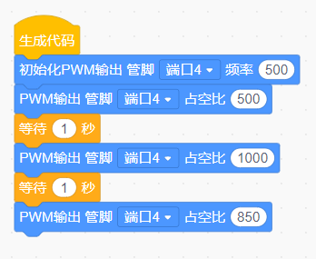

<h1 class="text-center">无刷马达</h1>

## 1 使用条件

- 电压使用范围：7.4-16.8V；

-  使用环境温度范围：-20℃~60℃；

-  保存温度范围：-20℃~70℃；

  

## 2 测定条件

- 温度： 25±10℃(主要用于检测相间阻值管控，抑制温度波动对阻值的影响)；

- 湿度： 常湿条件；

- 测试装置： DC30V30A直流稳压电源；航模电机性能测试仪；三相电阻测试仪；

-  额定电压： 11.1V±0.3V。 

  

## 3 电气磁性能要求

- 额定电压： 11.1V±0.3V； 

- 空载转速/KV值：10650±10%rpm/960KV±10%；

- 空载电流：≤0.85A；

- 定子尺寸：直径23mm*高度12mm；

- 磁路结构：12N14P；

- 漆包线直径：Ø0.21mm；

- 漆包线股数：5根；

- 绕线圈数： 12.5圈；

-  相间电阻值：0.12±10%Ω(1Ω档)；

- 漆包线耐温等级180℃；

- 磁铁耐温等级SH级，既120° C无退磁现象。 

  

## 4 电机安全安装要求

电机固定座、外壳、端盖、轴枝为金属物件，且为配合件;电机绝缘所指的就是电机 内绕组与外壳部件无接通且绝缘的电阻≥10MΩ，所以螺丝锁入固定座、端盖时，需要保 证螺丝不会顶住电机绕组，如果螺丝顶住绕组之后,会导致绝缘电阻为零(简单的测试方 式为:用蜂鸣器的一端接电机引线线头，另一端接电机轴或者螺丝或者外壳,蜂鸣器接通 报警就说明螺丝过长已经顶住线圈,反之则没顶住)。由于螺丝与电机外壳、固定座、轴 本身为连接部位，所以它们之间本身就是导通的，测试电机是否被螺丝顶住线圈的方式 是一端接电机引线线头，另一端接轴或外壳，电机打上螺丝后用蜂鸣器检测螺丝和轴导 通漏电属于正常现象。

## 5 外形尺寸图

## 6 性能参数表

## 7 机械特性及外观要求

- 外形尺寸以外形图纸为准； 
- 固定座、端盖均喷砂氧化中国红色,机壳电泳黑色，表面要求无污物，无明显划痕等；
- 电机焊接20#黑色硅胶引线，线长70mm；
- 单个电机重量： 52±5g；
- 磁铁、定子铁芯正常使用过程中不可有明显脱落松动现象发生。

## 8 示例程序

将无刷电机连接电调连接驱动板再连接主板后，在weeecode编写如下代码

初始化PWM输出配置PWM频率，第一个PWM输出占空比是设置占空比下限，第二个是上限，第三个是用户配置的数值，用户可以在范围内增大或减小这个数值。其他数值推荐保持不变。

打开串口，点击调试，无刷电机转动。

如果电机一侧电机不转，可以尝试调整第三个占空比到900-980。

## 9 注意事项

无刷电机需要通过主板控制无刷电机控制模块再经过电调来驱动。

主板和模块的部分不多赘述，我们来详细介绍一下电调。

> 电调的全称是电子调速器，英文Electronic Speed Control,简称ESC。电调最主要的应用是航模，车模，船模，飞碟，飞盘等等玩具模型上面。这些模型通过电调来驱动电机完成各种指令，模仿其真实工作功能，以达到与真实情况相仿的效果。所以有专门为航模设计的航模电调，为车模设计的车模电调等等。电调的功效就是控制电机，完成规定速度、动作。所以电调在生产生活中也有很广阔的应用，比如电动工具上的电调，医疗设备上的电调，汽车涡轮机上的电调，特种风机专用电调等等，不一而足。某些电调的生产厂家会根据你的不同需要和电机参数，为你量身定制电调。

我们使用的无刷电机是三相电机，而我们的供电是只有正负的二相电。因此，使用电调将二相电转成三相电得以驱动无刷电机。

无刷电调的三条线可以任意接，如果转向不对，把其中的任意两条线对调一下就可以了。