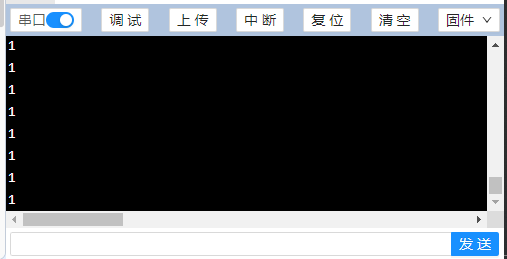
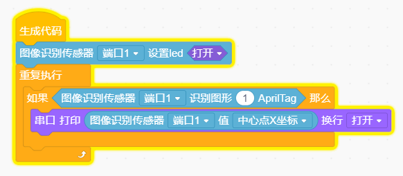
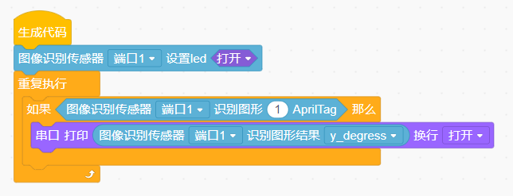
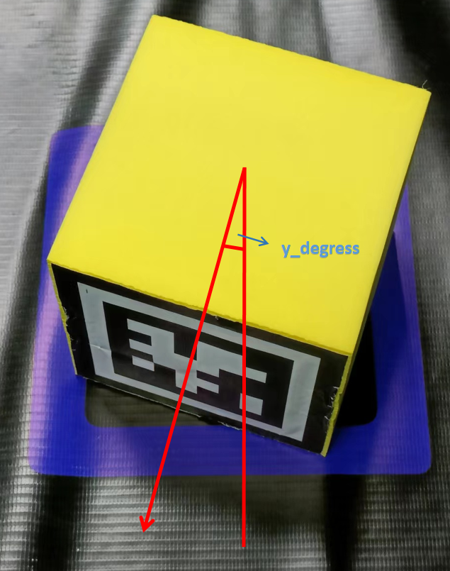
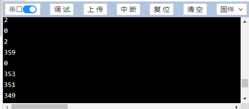

<h1 class="text-center">图像识别传感器模块 V2</h1>

## 1 简介

相比于之前的图像识别模块，2.0版本使用了运算速度更快，图像处理能力更强的K210模组。该模组内置64位双核高性能处理器，具有FPU单元，2个加速器KPU和FFT，支持多种AI编程框架。除了1.0具有的功能外，支持用户二次开发和学习，可以进行人脸识别、物体分类、机器学习等功能。模块具有USB接口，连接软件后可以直接看到视频图像，方便开发。

## 2 参数规格

- 处理器：K210 AI芯片
- 内核：RISC-V Dual Core64bit
- 主频：400MHz~600MHz
- SRAM：8M
- 摄像头：200W(OV2640,60°) / 30W(GC0328,160°)
- TF卡槽：1个
- 补光LED灯：1个
- micro USB：1个
- 工作电压：DC 5V
- 通讯方式：WM单总线
- 模块尺寸：4.8CM*2.8CM（长*宽）

## 3 代码块介绍

模块出厂内置python固件，通过这个固件可以和主控单总线通讯，软件中的编程都是基于这个固件开发的。当然用户可以二次开发，自己编写一个python固件，大体的方式可以参考ELF K210主控板的相关介绍，这里不做解释。更改固件和查看视频图片处理信息都是通过micro USB口，RJ11口的单总线只能下达指令和反馈识别信息。

编程时可以先参考图像识别模块V1.0的编程指南，里面的操作基本上都适用与V2.0，下面介绍之前没有或者更新后的积木块：

此积木块只适用于V1.0，新版本能自动识别模式，不需要提前设置。

此积木块用于打开和关闭V2.0模块上的补光灯。选择的端口为模块连接主控板的端口号。

此积木块用于Qrcode二维码、apriltag码识别，20种物品分类，特定交通卡片识别。编程中用于做判断，当识别到指点功能的图片时，比如选择apriltag，当识别到有apriltag码时会返回1，否则返回0。至于结果需要下面的识别结果语句。

此积木块用于返回识别到结果，num：数字编号（如apriltag的码值，20种物体的序号，交通卡片的序号等）；qrode：二维码的内容；

x_degress：摄像头和apriltag码的前后角度[90°,270°]，正对着是180°；

y_degress：摄像头和apriltag码的左右角度[0°,90°]或[270°,360°]，正对着是0°；

z_degress：摄像头和apriltag码的旋转角度[0°,360°]，正对着是0°；

此积木块的功能是判断是不是指定的AprilTag码值。当视野中有多于1个的AprilTag码时，之前的积木块只反馈其中的一个码的信息，很可能摄像头拍到了想要识别的码，但没有正确反馈信息，此积木块就可以指定某一个去识别，识别到了返回1，没识别到返回0。识别到后，可以通过上面提到的积木块查询结构。此积木块中的数值就是AprilTag码的num值。

## 4 示例程序

4.1 编写如图代码

4.2 准备如图1号tag标签

4.3 连接好主板和图像识别传感器模块，打开串口调试代码。倘若没有识别到标签，串口打印0；当识别到标签后，串口打印1。现象如图所示：

没有识别到：

识别到以后：

4.4 模块测试成功，不仅需要识别出二维码，还需要矫正机器人的姿态以确保机械爪在抓取二维码方块的时候是正对着它的。因此，我们需要得到二维码的中心点坐标参数以判断二维码是否于机器人视野居中。下图代码示例返回二维码中心点的坐标参数。最后根据机器人结构的细微差异调整代码。

#### 

4.5 当图像识别传感器识别到April Tag码值为1的图片时，打印出这个码的y_degress角度值，同学们可以通过调整二维码方块的位置观察该值的变化。

4.6 关于y_degress指的是二维码上建立的直角坐标系中，以y轴为轴心旋转时二维码的角度变化量。同样的，x_degress和z_degress都是以对应坐标轴方向为轴心旋转时，二维码的角度变化量。

例如，当二维码块没有正对摄像头时就会产生y_degress偏移量。这时我们通过y_degress来调整位置，使得机械爪能够顺利抓取。

如下图y_degress的串口打印界面，当y轴对齐，y_degress值会在0-10或者350-359之间跳动。

## 5 注意事项

- 光线的强弱和反光对识别效果影响很大，当识别效果不好时建议打开传感器板载的led灯或者调整摄像头的角度或光照条件。
- 距离是影响二维码识别的一大因素，如果距离过远会导致无法正常识别。建议在调用二维码识别前调整好摄像头到二维码方块之间的距离。

>  参考资料：
>
>   [Apriltag定位和识别 - 知乎 ](https://zhuanlan.zhihu.com/p/91318636)
>
>  [根据Apriltag进行角度和距离检测-云社区-华为云 ](https://bbs.huaweicloud.com/blogs/323412)
